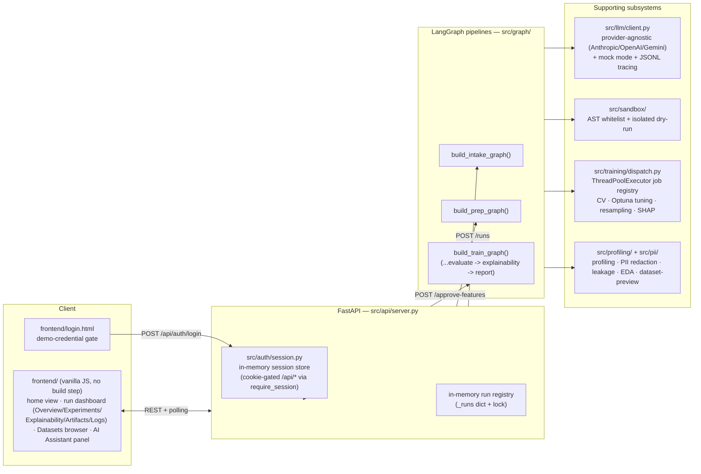
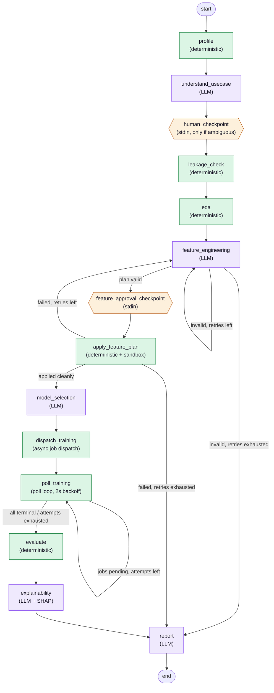
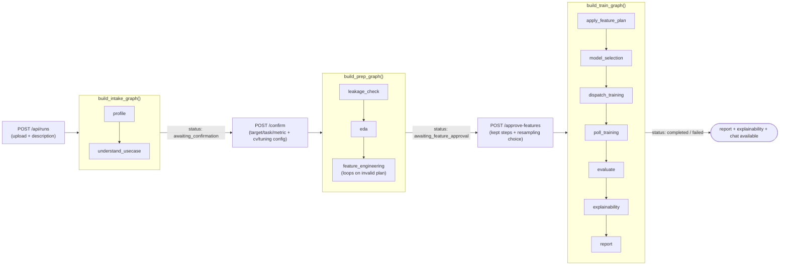
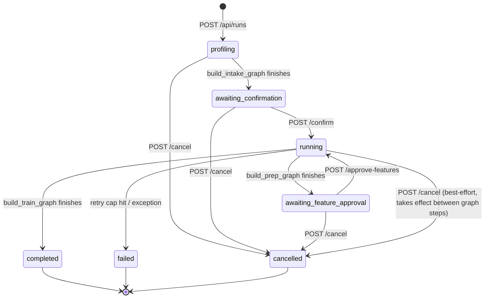

# Agentic AutoML Platform

Upload a dataset, describe your goal in plain language, and a **LangGraph-orchestrated
agent pipeline** profiles the data, confirms the task with you, engineers features,
trains and tunes candidate models asynchronously, and returns the best model with a
plain-language report you can question in a built-in chat panel.

**Non-negotiable rule: raw data never enters an LLM context window.** Every LLM-backed
node sees only redacted statistical profiles, schemas, small capped samples, or tool
results — never a raw DataFrame or CSV content. All data manipulation happens in
deterministic Python or a sandboxed execution layer. See [CLAUDE.md](CLAUDE.md),
[PRD.md](PRD.md), and [DESIGN.md](DESIGN.md) for the full product/architecture spec this
codebase implements.

## Table of contents

- [Architecture at a glance](#architecture-at-a-glance)
- [The LangGraph pipeline](#the-langgraph-pipeline)
  - [PipelineState — the contract between nodes](#pipelinestate--the-contract-between-nodes)
  - [Full pipeline graph (CLI)](#full-pipeline-graph-cli)
  - [How the web API splits the same graph in three](#how-the-web-api-splits-the-same-graph-in-three)
  - [Run status state machine (API)](#run-status-state-machine-api)
  - [Node-by-node reference](#node-by-node-reference)
- [Cross-cutting subsystems](#cross-cutting-subsystems)
- [Authentication](#authentication)
- [The AI Assistant chat panel](#the-ai-assistant-chat-panel)
- [Frontend](#frontend)
- [API reference](#api-reference)
- [Repository structure](#repository-structure)
- [Configuration](#configuration)
- [Quickstart (local)](#quickstart-local)
- [Testing](#testing)
- [Local stand-ins vs. production](#local-stand-ins-vs-production)
- [Known limitations / open questions](#known-limitations--open-questions)

## Architecture at a glance



The frontend never talks to LangGraph directly — it polls `GET /api/runs/{id}` every
1.5s and renders whatever `PipelineState` the run has accumulated so far (stage
timeline, live training progress, results table, insights, chat). Every `/api/*` data
endpoint is gated behind a session cookie set by the demo login page (see
[Authentication](#authentication)). Each of the three human-checkpoint boundaries
(upload → confirm → approve-features → train) is a **separate HTTP round trip**, not a
LangGraph `interrupt` — see
["How the web API splits the same graph in three"](#how-the-web-api-splits-the-same-graph-in-three).
A run's dataset isn't single-use either: `POST /api/runs/{id}/experiments` starts a new
run against the *same* uploaded file with a new use-case description, reusing the
already-computed profile — see the [API reference](#api-reference) and the
[Datasets browser](#frontend) in the frontend section.

## The LangGraph pipeline

### PipelineState — the contract between nodes

Every node reads and writes a single typed dict, `PipelineState` (`src/state.py`). Its
key regions:

| Region | Fields | Populated by |
|---|---|---|
| Input | `run_id`, `dataset_path`, `use_case_description` | `new_state()` |
| Profiling | `profile`, `leakage_flags`, `eda_report`, `resampling_suggestion` | `profile_node`, `leakage_check_node`, `eda_node` |
| Task spec | `task_spec` (a `TaskSpec`: target column, task type, metric, time column), `needs_human_confirmation`, `human_confirmed` | `understand_usecase_node`, the `/confirm` endpoint |
| Feature plan | `feature_plan` (a `FeaturePlan` of `FeatureStep`s), `feature_plan_valid`, `feature_plan_feedback`, `resampling_plan`, `transformed_dataset_path`, `training_preprocess_steps` | `feature_engineering_node`, `apply_feature_plan_node`, the `/approve-features` endpoint |
| Modeling | `candidate_models`, `cv_enabled`/`cv_folds`, `tuning_enabled`, `feature_selection_enabled`/`feature_selection_result`, `training_run_ids`, `training_results`, `best_model` (incl. nested `best_model["explainability"]`) | `model_selection_node`, `dispatch_training_node`, `poll_training_node`, `evaluate_node`, `explainability_node` |
| Output | `report`, `errors`, `retry_count`, `status` | `report_node`, routing functions |

Structured Pydantic models (`TaskSpec`, `FeatureStep`/`FeaturePlan`, `CandidateModel`,
`TrainingResult`, `TuningInfo`, `ExplainabilityResult`/`FeatureImpact`/`ShapPlot`/
`KeyInsight`) back every field that crosses a node boundary — LLM output is always
validated against one of these schemas before it's trusted (CLAUDE.md rule #2:
structured output over free-form code).

### Full pipeline graph (CLI)

`build_graph()` (`src/graph/build_graph.py`) is the complete pipeline `run_local.py`
invokes in one shot, with human checkpoints as **stdin prompts**:



Every loop-back edge is capped: `route_after_feature_engineering` and
`route_after_apply_feature_plan` (`src/graph/routing.py`) check
`retry_count["feature_engineering"] < config/runtime.yaml:retry.max_retries` (default
3) before looping, and fall back to `report` (with `status="failed"` and an explanatory
entry in `errors`) if the cap is hit — the pipeline never silently hangs (CLAUDE.md
rule #3). The `poll_training` loop is capped separately by
`training.poll_max_attempts` (default 150 × 2s ≈ 5 minutes).

### How the web API splits the same graph in three

`run_server.py`'s FastAPI backend does **not** run `build_graph()` end-to-end — a
LangGraph run can't pause mid-invocation for a browser round trip. Instead
`src/graph/build_graph.py` exposes three smaller compiled graphs, and
`src/api/server.py` starts the next one only after the corresponding endpoint is
called, in a background thread:



Two consequences worth knowing:

- **The API's human checkpoint is stricter than the CLI's.** `build_intake_graph()`
  always ends at `awaiting_confirmation`, whether or not `task_spec.is_ambiguous` —
  the browser always shows the confirm form (there is no silent-continue path), unlike
  the CLI's `human_checkpoint` node which skips the stdin prompt entirely when the task
  spec isn't ambiguous.
- **A failed plan can't silently regenerate after human approval.**
  `route_after_apply_feature_plan_approved` (used only by `build_train_graph()`) has no
  retry loop back to `feature_engineering` — if the *already-approved* plan fails to
  apply, the run fails outright rather than quietly replanning something the user never
  reviewed. The CLI/prep-graph variants (`route_after_apply_feature_plan`,
  `route_after_feature_engineering_prep`) do retry, because nothing has been shown to a
  human yet at that point.

### Run status state machine (API)



### Node-by-node reference

| Node | Kind | File | What it does |
|---|---|---|---|
| `profile` | deterministic | `src/graph/nodes.py` | Reads the CSV, calls `profile_dataset()` (schema, null rates, cardinality, PII report, correlations/clusters, data-quality block). |
| `understand_usecase` | LLM | `src/agents/understand_usecase_node.py` | Parses the natural-language description + profile into a `TaskSpec`; sets `needs_human_confirmation` if ambiguous. |
| `human_checkpoint` | deterministic (CLI only) | `src/graph/nodes.py` | stdin prompt to correct the task spec, only if ambiguous. The API replaces this with the mandatory `/confirm` endpoint. |
| `leakage_check` | deterministic | `src/graph/nodes.py` → `src/profiling/leakage.py` | Best-effort heuristics for columns that leak the target (name hints, near-perfect correlation, categorical purity). |
| `eda` | deterministic | `src/graph/nodes.py` → `src/profiling/eda.py` | Rule-based feature-step suggestions (impute/encode/scale/drop/datetime-decompose) + a resampling suggestion for imbalanced targets — grounds the LLM's plan in this specific dataset. |
| `feature_engineering` | LLM | `src/agents/feature_engineering_node.py` | Emits a structured `FeaturePlan`; any `custom_code` step is AST-validated here (not yet executed). A deterministic completeness floor adds any EDA-flagged column the LLM's plan skipped. Retries on an invalid plan. |
| `feature_approval_checkpoint` | deterministic (CLI only) | `src/graph/nodes.py` | stdin approval of individual steps + the resampling suggestion. The API replaces this with `/approve-features`. |
| `apply_feature_plan` | deterministic + sandbox | `src/graph/nodes.py` | Applies stateless/structural steps (drop, one-hot/ordinal encode, datetime decompose, most-frequent/constant impute, `custom_code` after a sandboxed dry-run). Statistical steps (mean/median impute, scale, target-encode) are *deferred* into the training job so they fit on the training fold only. |
| `model_selection` | LLM | `src/agents/model_selection_node.py` | Proposes a shortlist with data-aware hyperparameters + rationale. A deterministic completeness floor (`_CANONICAL_ESTIMATORS`) still trains every applicable model family regardless of what the LLM proposed. |
| `dispatch_training` | deterministic | `src/graph/nodes.py` → `src/training/dispatch.py` | Fires off one async job per candidate via `train_model` (`@tool`), returns immediately with `run_id`s — never blocks on training (CLAUDE.md rule #4). |
| `poll_training` | deterministic (loop) | `src/graph/nodes.py` | Polls each job's status with backoff until all are terminal or the attempt cap is hit. |
| `evaluate` | deterministic | `src/graph/nodes.py` | Picks the best candidate by the task spec's metric (lower-is-better for `rmse`/`mae`). |
| `explainability` | LLM + SHAP | `src/agents/explainability_node.py` → `src/training/dispatch.py` (`compute_explainability`) | Runs once, only for `best_model` (not every discarded candidate): builds a SHAP explainer (tree/linear/kernel), ranks feature impact, renders beeswarm/bar/dependence plots, computes a fidelity R², then two LLM calls write a plain-language narrative and caption the plots + a tone-coded Key Insights list. Never fails the pipeline — degrades to `method="unavailable"` with a note. |
| `report` | LLM | `src/agents/report_node.py` | Writes the final plain-language narrative from the (already-computed, already-redacted) task spec/feature plan/results — always runs, even on a failed/capped-out run, so every run ends in a clear explanation. |

## Cross-cutting subsystems

**PII redaction (`src/pii/redact.py`)** runs before any profiling output is built
(CLAUDE.md rule #5): column-name hints (`email`, `ssn`, `phone`, …) and value-pattern
matching (regex against a sample) flag PII columns, which are then blanked to
`"[REDACTED]"` in the frame used for anything LLM-facing. The original, un-redacted
frame is only ever touched by deterministic training code, never by an agent.

**Deterministic profiling (`src/profiling/profile.py`)** produces the one artifact
that stands in for raw data everywhere downstream: row/column counts, per-column
dtype/null-rate/cardinality, numeric summaries, correlation pairs (or correlation
*clusters* for wide datasets > 50 columns, to keep the LLM's context bounded), a
**data-quality block** (`completeness`, `duplicate_row_rate`, `uniqueness`, `overall`
— powers the dashboard's Data Quality panel), and at most 5 redacted sample rows.

**Leakage detection (`src/profiling/leakage.py`)** is explicitly best-effort, never
a guarantee — every surfaced flag says so, per CLAUDE.md's open-questions note.

**Structured plans over free-form code.** Both `feature_engineering_node` and
`model_selection_node` emit schema-validated JSON (`FeaturePlan`, `CandidateModel`
list), not code — the one exception is a `custom_code` `FeatureStep`, which must pass
`src/sandbox/validate.py`'s AST whitelist (blocks `eval`/`exec`/`open`/`os`/`sys`/
`subprocess`/network modules/dunder access, requires a top-level `def transform(df)`)
and then a resource-capped, timeout-bounded dry-run on a small sample
(`src/sandbox/execute.py`, via a separate process) before it's ever allowed to touch
the full dataset.

**Async training (`src/training/dispatch.py`)** is the busiest module in the repo:

- A `ThreadPoolExecutor`-backed job registry stands in for Celery/Ray; `train_model`
  (a `@tool`) returns a `run_id` immediately, `poll_training_job` reports status.
- **Cross-validation**: `StratifiedKFold`/`KFold`/`TimeSeriesSplit` depending on task
  type and whether a `time_column` was set; fold count auto-reduces for small/rare
  classes and reports *why* rather than silently omitting CV.
- **Hyperparameter tuning**: Optuna (TPE sampler) searches per candidate, with the
  LLM-proposed hyperparams always scored first as trial 0 — the tuned model can never
  do worse than the untuned baseline. Live per-trial progress is written to the job
  registry so the UI's tuning-progress bars update mid-run.
- **Resampling**: SMOTE / random over-/under-sampling (imbalanced-learn), applied only
  inside the training fold via an `imblearn.pipeline.Pipeline` so synthetic rows never
  leak into a CV test fold or the holdout set. SMOTE auto-falls-back to random
  oversampling when the minority class is too small for its `k_neighbors`.
- **Hyperparameter sanitization**: LLM-proposed `max_features="auto"` for sklearn tree
  ensembles (a value removed in sklearn 1.3+, though still the historical default an
  LLM is likely to suggest) is remapped to its true historical equivalent —
  `"sqrt"` for classifiers, `None` for regressors — in `_build_estimator`, so a very
  plausible LLM suggestion doesn't fail every run.
- **Target-cardinality guardrail**: `POST /confirm` rejects a classification task
  whose target column has more unique values than half the row count
  (`src/profiling/heuristics.target_too_high_cardinality_for_classification`) — such a
  target makes a holdout split structurally unable to generalize (most test-set
  classes were never seen in training) and makes XGBoost's stricter contiguous-label
  validation fail outright.
- All statistical preprocessing (impute/scale/target-encode) lives *inside* the fitted
  sklearn `Pipeline`/`ImbPipeline`, fit on the training fold only — `cross_validate`
  re-fits it per fold, so no test-fold statistic (or, for target encoding, any label)
  ever leaks into training.
- **Feature selection** (opt-in, `feature_selection_enabled`): `select_features()`
  runs RFECV *once*, with a basic linear model, in `dispatch_training_node` before any
  candidate trains — the eliminated/kept subset is shared by every candidate so all
  models compete on the same feature space, and the result (`feature_selection_result`)
  records what was dropped and why.

**Explainability (`src/agents/explainability_node.py` + `src/training/dispatch.py`)**
runs once per completed run, for the winning model only:

- `compute_explainability()` loads the fitted pipeline, builds the appropriate SHAP
  explainer (`TreeExplainer` for tree ensembles, `LinearExplainer` for linear models,
  falling back to `KernelExplainer` otherwise), and computes mean absolute/signed SHAP
  impact per feature, a **fidelity R²** (how well the linear SHAP reconstruction
  matches the model's actual output — the sigmoid link is applied for boosting/logistic
  classifiers scored in log-odds space, per commits `dc5668c`/`fa5a940`), and
  beeswarm/bar/dependence plots (rendered server-side to base64 PNGs).
- `explainability_node` then makes two LLM calls — a plain-language narrative of the
  top drivers, and a JSON-schema'd call that captions each plot and writes a tone-coded
  (`driver`/`risk`/`minor`) **Key Insights** list — and stores everything on
  `best_model["explainability"]` (an `ExplainabilityResult`). Every failure mode (SHAP
  unsupported for this estimator, plotting error, LLM error) degrades gracefully
  (`method="unavailable"` + a note) rather than failing the run.
- `sample_local_explanation()` is a separate, **on-demand** (not precomputed) helper:
  it reproduces the training-time split to sample a real held-out row and returns a
  per-row SHAP waterfall, so the frontend's Local Explanation sub-tab can serve a fresh
  example on every "View another example" click. `POST /predict`'s own
  `explain_prediction()` call is the same idea applied to a user-submitted row on the
  "Test the model" tab.
- Tunable via `config/runtime.yaml`'s `explainability` block (`top_n_features`,
  `max_background_rows`, `dependence_plot_top_n`); the two LLM calls have their own
  `config/models.yaml` entries (`explainability`, `explainability_captions`).

**Deterministic auto-insights (`src/insights/auto_insights.py`)** derive
plain-language, tone-coded observations (PII redacted, wide dataset, high null rate,
class imbalance, identifier-like column, model performance) directly from
`PipelineState` — no extra LLM call, so they appear instantly and are fully
explainable. The same module also derives the chat panel's suggested-question chips.

**Provider-agnostic LLM client (`src/llm/client.py`)** reads `config/models.yaml` to
pick a provider (Anthropic/OpenAI/Gemini) and model *per node* — switching a node's
model is a one-line YAML edit, never a code change. `AUTOML_MOCK_LLM=1` swaps every
provider call for a deterministic canned response (still trace-logged), so the entire
pipeline and web UI run with no API keys or network. Every call — prompt, response,
provider/model, error — is appended to `logs/traces/{run_id}.jsonl`
(`src/llm/tracing.py`), a local stand-in for LangSmith, and exposed via
`GET /api/runs/{id}/trace`.

## Authentication

Every `/api/*` data endpoint (runs, datasets, chat, predict, explainability, ...) is
gated behind `require_session` (`src/api/server.py`), a FastAPI dependency that 401s
any request without a valid, unexpired session cookie. This is a **single-demo-user
local gate**, not production multi-tenant auth (see
`docs/superpowers/specs/2026-07-05-login-page-design.md`):

- `src/auth/session.py` is an in-memory `{token: {email, expires_at}}` dict — no
  database, lost on server restart, same "local stand-in" pattern as the `_runs`
  registry.
- `POST /api/auth/login` checks the submitted email/password against
  `AUTOML_DEMO_EMAIL`/`AUTOML_DEMO_PASSWORD` env vars (default
  `demo@automl.local`/`demo123`), sets an httponly `automl_session` cookie
  (`config/runtime.yaml`'s `auth.session_ttl_hours`, default 24h) on success.
  `GET /api/auth/demo-credentials` is deliberately unauthenticated — it's a displayed
  hint for this demo build, not a secret.
- `frontend/login.html` (+ `login.js`) is a standalone static page outside the SPA
  shell; on successful login it redirects to `/`. `GET /` itself redirects
  unauthenticated requests to `/login.html` server-side; `app.js`'s `authFetch` wrapper
  additionally redirects the SPA to `/login.html` on any 401 from an API call.
- `POST /api/auth/logout` destroys the session and clears the cookie (wired to the
  dashboard's logout button).

## The AI Assistant chat panel

Once a run reaches `completed`/`failed`, its dashboard's right-rail "AI Assistant"
panel lets you ask questions about *that run's* results. It is deliberately **not** a
LangGraph node — it's an on-demand call (`src/agents/chat_node.py`,
`POST /api/runs/{id}/chat`) invoked directly by the API, gated to only run once the
report exists (409 otherwise). It receives exactly the same already-redacted,
already-computed subset of `PipelineState` the report/frontend already show (profile
summary, EDA insights, leakage flags, feature-plan steps, training results, best
model, report narrative) — never the raw dataset, and no tool access, so the
"raw data never enters an LLM context window" rule holds by construction. Suggested
questions are deterministic (derived from the run's own insights via
`suggested_questions()`), and conversation history is capped to the last 3 exchanges
per call so prompt size stays bounded.

## Frontend

`frontend/` is a multi-page, no-build-step vanilla JS/CSS app (`index.html`, `app.js`,
`styles.css`, plus the standalone `login.html`/`login.js`) served directly by FastAPI.
`index.html` itself is three views toggled in place by `app.js` (`#intake-view`,
`#run-view`, `#datasets-view`/`#dataset-detail-view`), each polling the relevant
`GET /api/...` endpoint every 1.5s while active. Every request goes through `authFetch`
(redirects to `/login.html` on a 401) — see [Authentication](#authentication).

- **Login page** (`login.html`) — email/password form posting to `POST /api/auth/login`,
  a displayed demo-credentials hint, and the same dark/light theme toggle as the rest
  of the app.
- **Home view** — a hero/intake form (the working "new run" flow), honest trust chips
  (no coding required, runs locally, raw data never reaches the LLM, full audit trace),
  a stats strip and Recent Projects list once runs exist, a live Pipeline-in-Progress
  mini-rail for the active run, and a 5-card "how it works" grid.
- **Run dashboard** — six tabs:
  - **Overview** — champion banner, "Journey of This Run" stage timeline, model
    leaderboard with why-this-model / why-other-models-weren't-selected callouts,
    "What AI Did During This Run", auto insights, feature importance, and a collapsible
    "test the model" panel built from the saved pipeline's actual input schema
    (predictions now come back with SHAP `contributions` + a waterfall plot).
  - **Experiments** — pipeline-stage progress, dataset summary, class distribution,
    data-quality overview, a model-performance bar chart, an experiment trend chart, an
    All Experiments table, and status/model/outcome/compute-time donut breakdowns —
    covers every experiment run against the same source dataset, not just this one.
  - **Explainability** — a stat-card row (model fidelity R², samples analyzed, model,
    target) then two sub-tabs: **Global View** (SHAP narrative + summary/bar/dependence
    plots + an LLM-written, tone-coded Key Insights list) and **Local Explanation** (a
    per-example SHAP waterfall with a "View another example" button that re-samples a
    fresh held-out row on demand).
  - **Artifacts** — model/script downloads.
  - **Logs** — pipeline event log, raw LLM audit trace, AI Summary, Next Steps, the AI
    Assistant chat panel, and recent activity.
  - Every panel hides itself when its backing data isn't available yet — nothing is
    fabricated. A "New experiment" action (`POST /api/runs/{id}/experiments`) starts a
    fresh run against the *same* uploaded dataset with a new use-case description,
    reusing the already-computed profile instead of re-uploading.
- **Datasets browser** (`#datasets-view` / `#dataset-detail-view`) — a top-level list of
  uploaded datasets (one entry per source upload, not per experiment), each opening a
  Data Preview: paginated/sortable/searchable raw rows, a per-column explorer (stats +
  any feature-plan/leakage ML insights for that column), and Column Summary /
  Correlations / Missing Values / Outliers sub-tabs. This view is deliberately
  read-only and dataset-scoped — it's reachable from any of that dataset's experiments
  via the run dashboard's "Data" tab.
- Light/dark theming is CSS-custom-property driven; SVG donuts and charts re-tint on
  toggle.

## API reference

Every route below except the four `/api/auth/*` routes requires a valid session cookie
(`Depends(require_session)`) — see [Authentication](#authentication).

| Method | Path | Purpose |
|---|---|---|
| POST | `/api/auth/login` | `{email, password}` → sets the session cookie; checks against `AUTOML_DEMO_EMAIL`/`AUTOML_DEMO_PASSWORD`. Unauthenticated. |
| POST | `/api/auth/logout` | Destroys the session, clears the cookie. |
| GET | `/api/auth/session` | `{authenticated, email}` — used by the frontend to decide whether to redirect to the login page. |
| GET | `/api/auth/demo-credentials` | Returns the demo email/password for display on the login page. Unauthenticated by design. |
| POST | `/api/runs` | Multipart upload (`file`, `description`) → `{run_id}`; starts `build_intake_graph()`. |
| POST | `/api/runs/{id}/experiments` | `{description}` → `{run_id}` — starts a new run against the *same* dataset file, reusing the source run's already-computed profile; pauses at the same confirm checkpoint as a fresh upload. |
| GET | `/api/runs` | List runs — `{run_id, filename, status, created_at, description, best_score, metric, source_run_id}`. |
| GET | `/api/datasets` | List top-level datasets (runs with no `source_run_id`) — `{run_id, filename, status, created_at, row_count, column_count, quality_score}`. |
| GET | `/api/runs/{id}` | Full run summary: status, stage timeline, task spec, profile (incl. quality/top_values), leakage flags, feature plan, training results, insights, report, chat history, suggested questions, errors. |
| POST | `/api/runs/{id}/confirm` | `{target_column, task_type, metric, time_column?, cv_enabled, cv_folds, tuning_enabled}` — the mandatory human checkpoint; rejects (400) high-cardinality classification targets; starts `build_prep_graph()`. |
| POST | `/api/runs/{id}/approve-features` | `{approved_step_indices, resampling_enabled, resampling_method}` — starts `build_train_graph()`. |
| POST | `/api/runs/{id}/cancel` | Best-effort cancellation; takes effect between graph steps, not mid-node. |
| GET | `/api/runs/{id}/model` | Download the best model (`.joblib`). |
| GET | `/api/runs/{id}/script` | Download a standalone, dependency-light Python script reproducing the winning run. |
| GET | `/api/runs/{id}/model/schema` | Raw input columns/types the saved pipeline expects (feeds the "test the model" form). |
| GET | `/api/runs/{id}/explainability` | Precomputed SHAP feature impact, narrative, plots, fidelity R², and Key Insights for the winning model (set once by `explainability_node`). |
| GET | `/api/runs/{id}/explainability/local-example` | `?seed=` — on-demand SHAP waterfall for one row sampled from the real held-out test split; a different row each call unless `seed` is fixed. |
| POST | `/api/runs/{id}/predict` | `{values}` → prediction (+ class probabilities, SHAP `contributions`, waterfall plot) from the saved model. |
| GET | `/api/runs/{id}/trace` | Full LLM audit trace (every prompt/response/provider/model for this run). |
| GET | `/api/runs/{id}/preview` | `?page&page_size&sort_by&sort_dir&search` — paginated raw dataset rows for the Data Preview tab, plus which columns are PII-flagged. |
| GET | `/api/runs/{id}/columns/{column}` | Per-column stats + any matching feature-plan step/leakage flag ("ml_insights") for the Data Preview column explorer. |
| GET | `/api/runs/{id}/correlations` | `?method=pearson\|spearman\|kendall\|mutual_info` — correlation matrix for the Data Preview Correlations sub-tab. |
| GET | `/api/runs/{id}/missing-values` | Missing-value matrix for the Data Preview Missing Values sub-tab. |
| GET | `/api/runs/{id}/outliers` | `?method=iqr\|zscore\|isolation_forest\|lof` — outlier rows/summary for the Data Preview Outliers sub-tab. |
| GET | `/api/runs/{id}/dataset-summary` | Feature-type counts + an ML-readiness score, derived from the profile/leakage flags. |
| POST | `/api/runs/{id}/chat` | `{question}` → `{answer}` — the AI Assistant; 409 until the run is `completed`/`failed`. |

## Repository structure

```
/src
  /agents          # LLM-backed nodes (one file per node) + prompts/*.md + chat_node.py, explainability_node.py
  /graph            # StateGraph definitions (build_graph.py), routing.py, nodes.py (deterministic)
  /profiling        # profile.py, eda.py, leakage.py, heuristics.py, preview.py (Data Preview tab helpers)
  /insights         # auto_insights.py — deterministic insights + suggested chat questions
  /tools            # typed @tool functions exposed to LLM agents (row-capped)
  /sandbox          # validate.py (AST whitelist), execute.py (isolated dry-run)
  /training         # dispatch.py — async job registry, CV, Optuna tuning, resampling, SHAP explainability
  /pii              # redact.py — PII detection/redaction
  /auth             # session.py — in-memory demo-login session store
  /api              # server.py — FastAPI backend (runs, datasets, auth, explainability, dataset-preview routes)
  /llm              # client.py (provider-agnostic + mock mode), tracing.py
  /export           # script_export.py — standalone training-script generator
  data_io.py        # shared, encoding/delimiter-tolerant CSV loading used by every pipeline stage
  state.py          # PipelineState schema (source of truth)
/frontend           # static multi-page UI (no build step): index.html, app.js, styles.css, login.html, login.js
/config
  models.yaml       # provider+model per node (incl. explainability, explainability_captions)
  runtime.yaml       # retry caps, sandbox limits, training/tuning/CV defaults, explainability config, auth session TTL, LLM budgets
/tests
  /fixtures         # synthetic datasets + generate_fixtures.py
run_server.py       # web entrypoint (API + frontend)
run_local.py        # CLI entrypoint (stdin human checkpoints, full build_graph())
```

## Configuration

**`config/models.yaml`** — a `default` block plus per-node overrides
(`understand_usecase`, `feature_engineering`, `model_selection`, `report`, `chat`,
`explainability`, `explainability_captions`); each entry sets
`provider`/`model`/`temperature`/`max_tokens`. API keys are read from environment
variables (`.env`, see `.env.example`) — never hardcoded.

**`config/runtime.yaml`** — every cap the pipeline enforces in code, not by
convention: `retry.max_retries` (loop-back cap), `sandbox.*` (timeout, sample rows,
memory), `tools.max_sample_rows` (row-level tool output cap), `explainability.*`
(`top_n_features`, `max_background_rows`, `dependence_plot_top_n` for SHAP), `training.*`
(concurrent job limit, poll interval/attempts, Optuna trial/budget defaults, default CV
folds), `auth.session_ttl_hours` (demo login session lifetime), and `budgets.*` (max LLM
calls/tokens per run).

**Demo login credentials** — `AUTOML_DEMO_EMAIL`/`AUTOML_DEMO_PASSWORD` env vars
(default `demo@automl.local`/`demo123`); see [Authentication](#authentication).

## Quickstart (local)

```bash
uv venv .venv
uv pip install -r requirements.txt --python .venv
```

### Web UI (recommended)

```bash
# no API keys needed for a first test drive:
cp .env.example .env        # then set AUTOML_MOCK_LLM=1 in .env
.venv/Scripts/python run_server.py
```

Open http://127.0.0.1:8000 — you'll be redirected to the login page; sign in with the
demo credentials shown there (`demo@automl.local` / `demo123` by default, overridable
via `AUTOML_DEMO_EMAIL`/`AUTOML_DEMO_PASSWORD`). Then drop a CSV (generate samples
first, below), describe the prediction goal, confirm the task spec when prompted,
review/approve the feature plan, and watch the pipeline run through to a downloadable
model + report + SHAP explainability + chat.

```bash
# generate sample datasets to play with:
.venv/Scripts/python -m tests.fixtures.generate_fixtures
```

### CLI

```bash
.venv/Scripts/python run_local.py --file tests/fixtures/imbalanced_classification.csv \
    --description "predict which customers will churn"
```

### Switching LLM providers

Per-node provider/model lives in [config/models.yaml](config/models.yaml) — each node
can independently use `anthropic`, `openai`, or `gemini`. Set the matching API key in
`.env`. With `AUTOML_MOCK_LLM=1`, all providers are bypassed with deterministic canned
responses (including for `chat`).

## Testing

```bash
.venv/Scripts/python -m pytest tests/
```

Notable fixtures/suites: highly imbalanced classification, high-cardinality
categoricals, time-series data (leakage-prone chronological split), wide datasets
(500+ columns), datasets with injected PII, ambiguous/missing target columns, malicious
sandboxed code (disallowed imports/infinite loops/wrong schema), and full API
integration tests (intake → confirm → approve-features → train → chat) run with
`AUTOML_MOCK_LLM=1` so no keys/network are needed in CI.

## Local stand-ins vs. production

| Concern | Local (this repo) | Production design |
|---|---|---|
| Job queue | `ThreadPoolExecutor` in-process | Celery/Ray + Redis |
| Sandbox | AST whitelist + subprocess w/ timeout | Docker/gVisor, no network, read-only mounts |
| Run store | in-memory dict | Postgres + model registry |
| Artifacts | `artifacts/` folder | S3-compatible object storage |
| Tracing | JSONL files in `logs/traces/` | LangSmith or equivalent |
| Auth | in-memory session store, single hardcoded demo user (`src/auth/session.py`) | Real multi-tenant auth (OAuth/SSO), sessions backed by Postgres/Redis |

## Known limitations / open questions

- **Leakage detection is heuristic, not guaranteed** — every surfaced flag says so
  explicitly; false negatives are expected (`src/profiling/leakage.py`).
- **Target/metric disambiguation always routes to a human checkpoint** rather than
  being silently auto-selected for ambiguous use cases (CLAUDE.md).
- **The exported training script** (`GET /.../script`) is a deterministic
  transcription of `apply_feature_plan`/`dispatch.py`'s logic with no shared code path
  by design (so it's dependency-free) — it can drift if those change without the
  export logic being updated in step.
- **The login gate is a single hardcoded demo user**, not real authentication — the
  in-memory session store is lost on every server restart and there is no per-user
  data isolation (every session sees every run). See [Authentication](#authentication).
- **SHAP explainability is best-effort**, same spirit as leakage detection: fidelity
  R² and plots can be `None`/absent for unsupported estimators, and the pipeline never
  fails a run over an explainability error.
  
